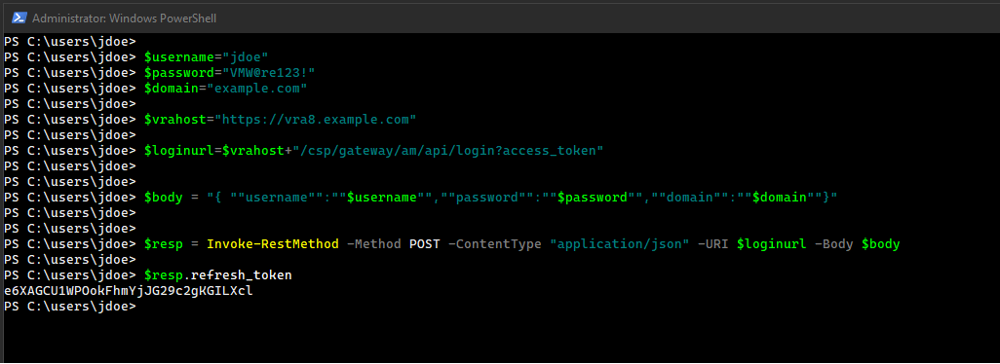
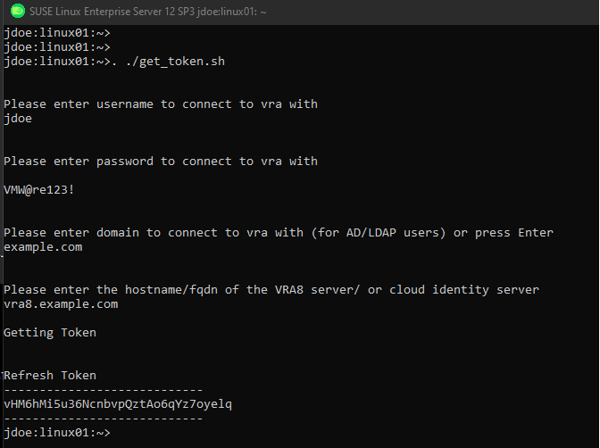

# Getting a refresh token


## refresh_token vs access_token

This provider will accept either an access_token or a refresh_token (but not both at the same time). Access tokens are valid for 8 hours, while refresh tokens are valid for 6 months.

# Process of getting a token

The process of getting a token is fairly straightforward. You will need user credentials consisting of:

* username
* password
* domain (optional, may or may not be needed)

In additon you will need the name of the host associated with the identity access service. For vRealize Automation Cloud this will be api.mgmt.cloud.vmware.com. For the on premise version vRealize Automation 8 this will be the hostname associated with the appliance(s) that was deployed.

You then pass a JSON body  containing the credential information to the Identity Service API.

```json
    # with domain
    { "username":"jdoe","password":"VMW@re123!","domain":"example.com"}

    # without domain
    { "username":"jdoe","password":"VMW@re123!"}
```

If successful you should receive a JSON response with multiple values in it from which the refresh token can be extracted.


## Bash example


## Powershell Example


## Included scripts
There are two scripts included in this repository in the docs folder that will prompt you for the needed values and print out the refresh token.  

* [get_token.ps1](./get_token.ps1) - Powershell script
* [get_token.sh](./get_token.sh) - bash script

### Running get_token.sh


### Running get_token.ps1


#### Reference Links

  https://vdc-repo.vmware.com/vmwb-repository/dcr-public/97d1d46c-8846-4c12-85a8-5655d1189825/488ad51d-542f-4439-ade2-f9caedeeab51/GUID-AC1E4407-6139-412A-B4AA-1F102942EA94.html