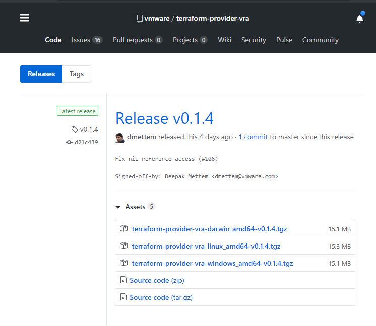
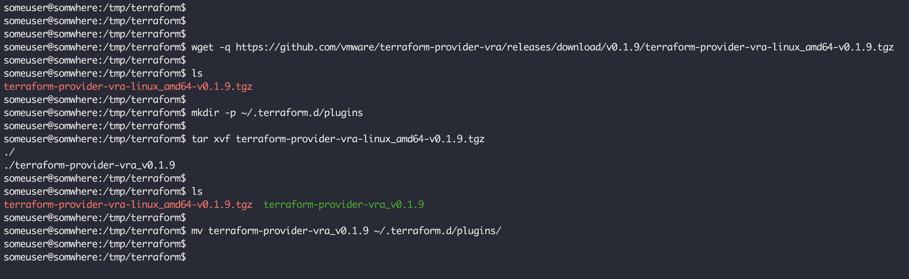
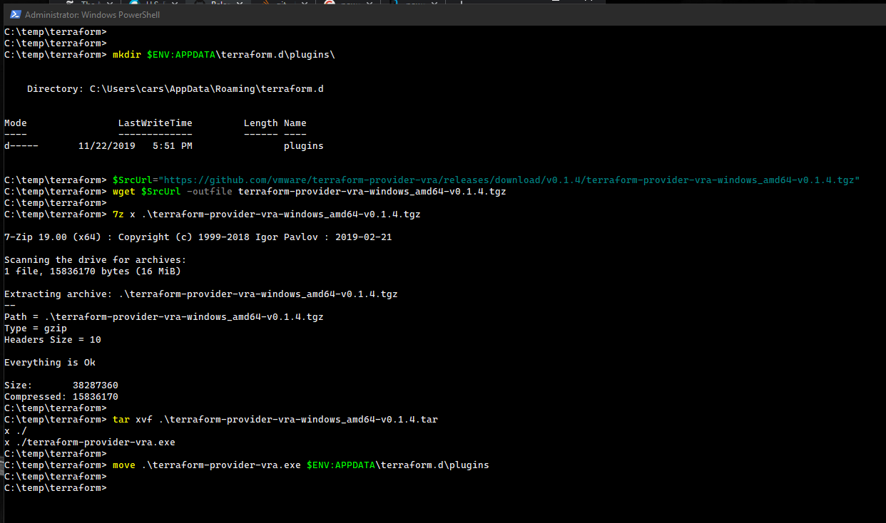
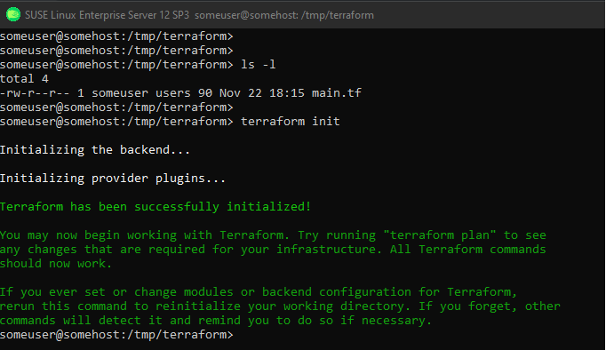

# Installing the vRA Terraform provider

The provider is currently considered to be a third-party provider and thus won't be automatically downloaded by ```terraform```, which means you have to either install or build it yourself. The provider is made available in a pre-built binary version via the GitHub repository in the form of releases. This document will walk you through installing a released version of the provider. _(The following snippets will use v0.1.7, but you will need to update the version as necessary)_

## Downloading the provider

 The most recent version of the provider can be found at https://github.com/vmware/terraform-provider-vra/releases/latest



You can download the appropriate version of the provider for your OS via either your browser or the commandline using a tool like curl or wget.

### Linux

Create a terraform plugins directory with your hardware platform subdirectory. Typically for 64bit Linux this will be in ```~/.terraform.d/plugins/linux_amd64``` on non-Windows platforms.

```bash
mkdir -p ~/.terraform.d/plugins/linux_amd64 
```

Download the plugin (via a browser or command line)

 ```bash
 wget -q https://github.com/vmware/terraform-provider-vra/releases/download/v0.1.7/terraform-provider-vra-linux_amd64-v0.1.7.tgz
 ```

Untar/unzip the plugin

```shell
tar xvf terraform-provider-vra-linux_amd64-v0.1.7.tgz
```

Move the extracted plugin to the terraform plugins directory

```shell
mv terraform-provider-vra ~/.terraform.d/plugins/linux_amd64 
```

#### Linux Example



### Windows

Create a terraform plugins directory typically this will be in ```%APPDATA%\terraform.d\plugins```.

```powershell
 #powershell
 mkdir $ENV:APPDATA\terraform.d\plugins
```

```cmd
#CMD
mkdir %APPDATA%\terraform.d\plugins
```

Download the plugin (via a browser or command line)

 ```powershell
 wget https://github.com/vmware/terraform-provider-vra/releases/download/v0.1.7/tterraform-provider-vra-windows_amd64-v0.1.7.tgz -outfile terraform-provider-vra-windows_amd64-v0.1.7.tgz
 ```

Untar/unzip the plugin _(Depending on your setup this may require two steps)_

```powershell
#using 7zip to unzip
7z x .\terraform-provider-vra-windows_amd64-v0.1.7.tgz

# then untar resulting file
tar xvf terraform-provider-vra-windows_amd64-v0.1.7.tar
```

Move the extracted plugin to the terraform plugins directory

```powershell
#Powershell
move terraform-provider-vra.exe $ENV:APPDATA\terraform.d\plugins
```

```cmd
#CMD
move terraform-provider-vra.exe %APPDATA%\terraform.d\plugins
```

#### Windows Example



## Validating the install

To validate the installation you can simple change to the location where your terraform configuration is located and run ```terraform init```. You should see a message indicating that terraform has been successfully initialized.


